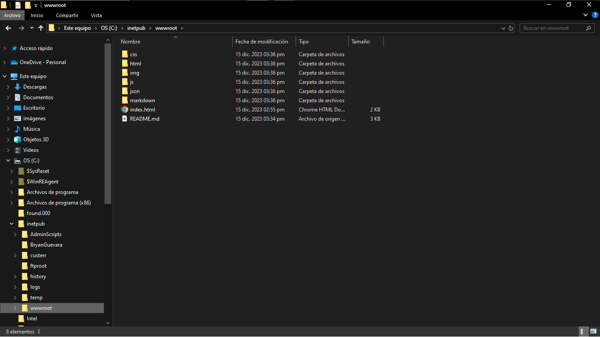

# Pagina Principal Google Chrome

Este proyecto fue realizado por **[BryanGuevara](https://github.com/BryanGuevara)** como una forma para poder personalizar su pagina de inicio de **Google Chrome**, la idea es tener los links de las paginas web que frecuenta en la pagina principal, de forma ordenada

---

### El Proyecto tiene actualmente

- Un **[Index](index.html)** que te da la bienvenida, aca se encuantran 5 enlaces *por el momento todas apuntan hacia [Jugar](html/Jugar.html)*:
    - **[Redes Sociales](html/Redes.html)**: se **encontraran enlaces** para mis redes sociales por ejemplo:
        - Facebook
        - Youtube
        - Instagram
        - etc
    - **[Jugar](html/Jugar.html)**: se **encuentran enlaces** para distintas paginas de juegos por ejemplo:
        - Paginas para jugar en linea:
            - [Chess.com](https://www.chess.com/home)
            - [Gamesfrog](https://gamesfrog.com)
            - etc
        - Paginas para descargar juegos de pc:
            - [SM4J](https://carlosxdjavgames.altervista.org/archivos/134)
            - [Albion Online](https://albiononline.com/home)
            - etc
        - Paginas para descargar Roms de Emuladores:
            - [Roms en Español](https://romsespanol.com/)
            - etc
    - **[Navegar](html/Jugar.html)**: se **encontraran enlaces** para distintas paginas para navegar por ejemplo:
        - Google
        - Yahoo!
        - etc
    - **[Hablar con una AI](html/IA.html)**: se **encontraran enlaces** para distintas paginas de AIs por ejemplo:
        - ChatGPT
        - Bard
        - Bing
        - etc
    - Otras Cosas
    - [Frases](json/frases.json) Motivacionales
        - 200 Frases con temas variados
            - Programacion
            - Biblia
            - Videojuegos
            - etc
    - [Fondos](img/fondos/) personalizado
        - Sistema Randomizador para poner una imagen cada que se carga la pagina
        - por el momento tiene mis 20 fondos de la pagina de bloqueo, pero para la version final tendra muchos y variados
---

### Imagenes y video de como implementar

#### Video de como activar el IIS 

*Seguir hasta el minuto 5:26, porque el resto del video es para una appweb de c# ASP.NET Core 6 y pues acá ya lo tienen todo, no necesitan esos pasos*

#### Como Implementarlo

Implementarlo es muy facil, en el **wwwroot** o en la carpeta que hayan hecho en el inetpub, colocan todo lo de este repositorio
*Excepto lo siguiente*
 1. *.git/*
 2. *.gitignore/*
 3. *markdown/*
 4. *README.md*

#### Como activarlo en Chrome

para poder implementar mi proyecto, en Chrome te vas a [Ajustes/Al Iniciar](chrome://settings/onStartup) activas **Abrir una ventana especifica o Conjunto de Ventanas** le das en **Agregar nueva Pagina** y pones el link **"http://localhost/"** 

*(Si lo pusiste en otro puerto tendras que añadirle el puerto **"http://localhost:80/"** como puerto por defecto viene el 80)*

---

Licencia Pública General de GNU, versión 3 (GPLv3)

Este trabajo está sujeto a los términos y condiciones de la Licencia Pública General de GNU, versión 3.

Texto completo de la Licencia Pública General de GNU, versión 3: **[GPLv3](markdown/Licence.md)**

---
## BryanGuevara

